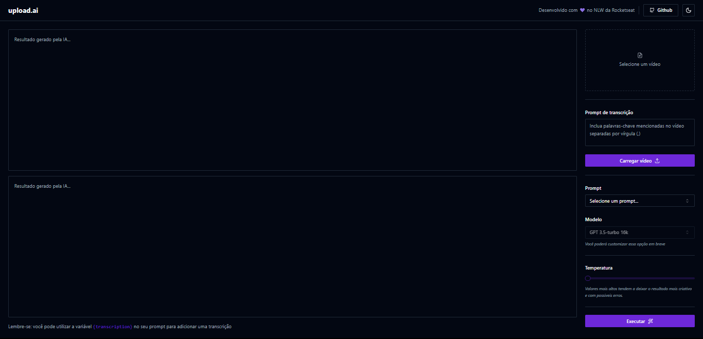

<h1 align="center"> Upload AI </h1>

<p align="center">
Aplicação que recebe vídeos e utiliza IA para gerar títulos e descrições . <br/>

<p align="center">
  <a href="#-tecnologias">Tecnologias</a>&nbsp;&nbsp;&nbsp;|&nbsp;&nbsp;&nbsp;
  <a href="#-projeto">Projeto</a>&nbsp;&nbsp;&nbsp;|&nbsp;&nbsp;&nbsp;
  <a href="#-layout">Layout</a>&nbsp;&nbsp;&nbsp;|&nbsp;&nbsp;&nbsp;
  <a href="#-web">Web</a>&nbsp;&nbsp;&nbsp;|&nbsp;&nbsp;&nbsp;
  <a href="#-server">Server</a>
</p>

<br>

<p align="center">
  
</p>

## 🚀 Tecnologias

Esse projeto foi desenvolvido com as seguintes tecnologias:

- Vite
- React
- TailwindCSS
- RadixUI
- ShadcnUI
- Fastify
- Prisma

## 💻 Projeto

O Upload AI tem a responsabilidade de gerar qualquer informação em relação a algum vídeo que será postado no Youtube, como o título e descrição, porém é possível utilizar outros recursos na aplicação

- [Acesse o projeto finalizado, online](#)

## 🔖 Layout

Acesse o Layout do projeto [aqui](#)

## 📋 Web

### Tópicos

<ul>
<li><a href="#tailwindcss">TailwindCSS</a></li>
<li><a href="#radix">RadixUI</a></li>
<li><a href="#shadcn">ShadcnUI</a></li>
</ul>

### TailwindCSS

<div id="#tailwindcss"></div>

O Tailwind é um processador de estilização CSS baseado em classes.
Todo tamanho colocado é um múltiplo de 4 (w-4 = width: 16px)

### RadixUI

<div id="#radix"></div>

Biblioteca com vários componentes React sem estilização

### ShadcnUI

<div id="#shadcn"></div>

Seguir a [documentação](https://ui.shadcn.com/docs/installation/vite) sobre a instalação da biblioteca para o Vite

```
npm install -D tailwindcss postcss autoprefixer
npx tailwindcss init -p
npm install -D @types/node
npx shadcn-ui@latest init
```

Bilioteca com vários componentes, principalmente do Radix, seguindo um estilo de design padrão com uma união dos componentes. Instala automaticamente o RadixUI e o TailwindCSS.
Os comandos acima são um exemplo do que devo fazer para iniciar um projeto com Shadcn, conforme na documentação de instalação.
Os componentes do Shadcn são copiados para dentro do projeto, ou seja, não vem de um pacote, como o MaterialUI ou Bootstrap

#### components/ui

Quando o shadcn é iniciado, o alias de @/components é usado para anexar todos os componentes que são baixados do shadcnUI, que vão na pasta ./ui

```
npx shadcn-ui@latest add button
npx shadcn-ui@latest add separator
npx shadcn-ui@latest add textarea
npx shadcn-ui@latest add label
npx shadcn-ui@latest add select
npx shadcn-ui@latest add slider
npx shadcn-ui@latest add dropdown-menu
```

### lucide react

```
npm install lucide-react
```

Utilizado para inserir ícones

## 📋 Server

### Tópicos

<ul>
<li><a href="#conteudo">Conteudo</a></li>
<li><a href="#fastify">Fastify</a></li>
<li><a href="#prisma">Prisma</a></li>
</ul>

### Conteúdo

<div id="#conteudo"></div>

```
npm init -y
npm install typescript @types/node tsx -D
```

O NodeJs em si não entende código em TypeScript, logo é necessário as instalações para que o tsx converta automaticamente o código para JavaScript on demand.

### Fastify

<div id="#fastify"></div>

```
npm install fastify
```

### Prisma

<div id="#prisma"></div>

```
npm install prisma -D
npx prisma init --datasource-provider sqlite
```

ORM para automatização na criação de tabelas e migrations. Tem sua própria sintaxe de DDL.
Após a criação dos models em schema.prisma, rodar o comando abaixo para gerar uma nova migration

```
npx prisma migrate dev
```

Abrir o studio do prisma

```
npx prisma studio
```

Todas as rotas do Prisma devem ser assíncronas, se não o servidor nunca é executado.
Se for necessário utilizar alguma rota para fazer o upload de arquivos (imagem, vídeo), deve-se utilizar uma biblioteca aparte (express -> multer, fastify -> fastify multipart)

```
npm install @fastify/multipart
```

Em aplicações Node, devemos especificar se queremos enviar arquivos JSON ou Multipart, por meio do register ou use()

### Upload de arquivos

Não e uma boa prática salvar dados de arquivos (imagens, vídeos) no diretório local do projeto. ALguns serviços para isso são: Amazon S3, CloudFlare R2 (mesma API do AS3).
Porém no projeto será salvo no disco para facilitar o desenvolvimento.
O NodeJS permite trabalhar com dados de Stream, ou seja, escrever e salvar aos poucos algum arquivo. Os dados vão chegando no Backend e já vão para o disco, sem necessidade de usar a memória para persistir até o download completo. Com isso, utiliza-se o pipeline juntamente ao promisify (rota post)

### Zod

```
npm install zod
```

Bilioteca para validação de dados, muito eficiente com o TypeScript

### OpenAi

```
npm install openai
```

Deve-se dar acesso à aplicação por meio de uma chave de API. Será utilizado o Whisper para transcrição do arquivo MP3.
O único problema é que a versão free tem limitações de uso.

#### Tokens

No site [Tokenizer](https://platform.openai.com/tokenizer), é possível saber quantos tokens são consumidos pela ai (um shorts de 40 segundos consumiu 3oo tokens, de completion mais de prompt):

- gpt 3.5 turbo: máximo de 4095 tokens
- gpt 5.5 turbo 16k: máximo de 16000 tokens

### Variáveis de ambiente

```
npm install dotenv -D
```

A versão do Node do projeto não suporta leitura de variaveis de ambiente nativamente. Logo é nenessário a biblioteca.
No arquivo que será utilizado o process.env, importar a lib 'dotnev/config'

### React

Sempre que um estado muda de valor, a aplicação sente o efeito e é renderizada

- useMemo: recebe uma função e um array de dependências como parâmetro. Permite com que a variavel que recebe o useMemo renderize somente se algum estado do vetor de dependências ter seu valor alterado.
- useRef: é possível utilizar o useRef para trabalhar como se estivesse manipulando a DOM

### Recurso do computador

Eu estava tendo problemas com a conversão do vídeo para áudio, ou mesmo o uso das pipelines da IA dentro do backend, onde o Node estava consumindo mais de 3GB de RA, o que ultrapassava o limite de 512 MB do plano gratuito do Render. Logo, uma solução poode ser implementar o uso da IA dentro do Frontend, pois usará de recursos do computadopr do usuário

### ffmpeg

```
npm install @ffmpeg/ffmpeg @ffmpeg/util
```

Principal biblioteca de edição audiovisual, será utilizada em paralelo com o webAssembly para que seja possível realizar a conversão no browser

### WebAssembly

Permite com que códigos que rodariam em backend possam ser executados no frontend

### Vercel AI

```
npm install ai
```

Permite com que a resposta de um modelo de inteligência artificial seja enviada aos poucos par a interface do usuário

### seed.ts

```
npx prisma db seed
```

Este arquivo é utilizado para popular o banco de addos do Prisma com os dois prompts de exemplo que serão executa pela IA. Deve ser inserido na pasta prisma e criar um script de comando no package.json
